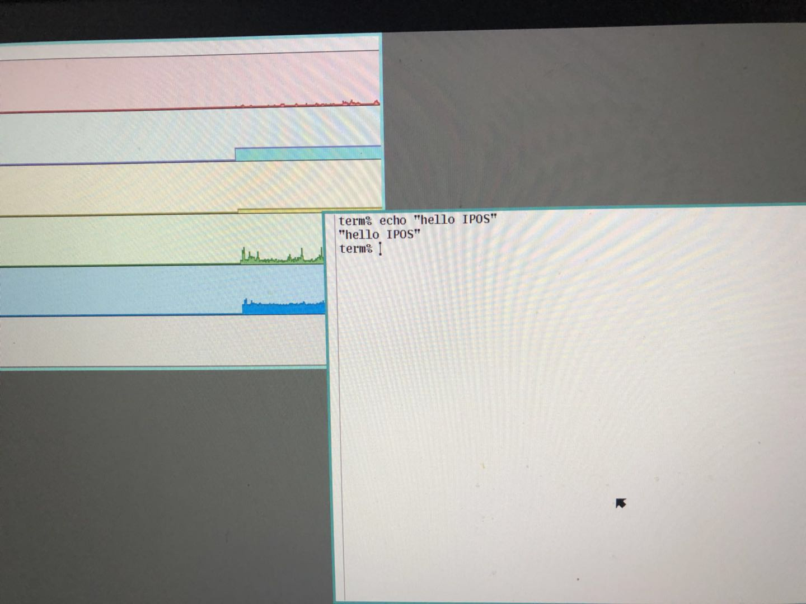

# IPOS --InterPlanetary Operating System
A distributed operating system with blockchain

[加电报群 准备领空投](https://t.me/iposio)
 
# IPOS

IPOS 是InterPlanetary operating system的缩写。是一款基于区块链的去中心化操作系统。
底层使用 IPFS 作为文件系统。

一个遵循 纳什均衡的经济规则的操作系统

IPOS币 是ipos操作系统的通用货币。用来购买 流量，cpu，带宽，内存，硬盘，数据库等。
也可用户 系统内的 应用消费。

|          |     | 
| --------     | -----:   | 
| 应用层          | go/java app| 
| 操作系统层           | plan9 /eth| 
| 文件系统  |   ipfs  |  
| 网络发现服务      |    p2p network   |  

# 募集

发行了10亿代币，在eos上。3亿募集，2亿空投，5亿保留。

参与募集方法： 转1eos 到 oo1122334455 会返回 1000 IPOS。随着IPOS 剩余量越来越少，兑换比例越来越小。

不要从交易所钱包直接提到此地址。

# 立项背景

以太坊，eos 一些智能合约区块链平台，既然智能合约能去中心化，为何不在此之上进行抽象，将操作系统进行去中心化呢？人类共用一个操作系统，底层的硬件是每个人的pc呢？

未来人们只有显示器、键盘和接入到 IPOS的设备足以。

去中心化具有匿名性，不可审核，不可监管，信息透明等特性。一个没人能删除不属于自己的数字资产的特性。也没人暗箱操作等。

操作系统去中心了，那么在操作系统之上的应用，自然具有去中心化属性。

IPOS不光有操作系统，还要内置几个基础应用。

1.去中心化的信息发布

目前的zeronet等基本可以实现这一目标。但是zeronet也需要连接bt服务，导致容易被屏蔽，也没用激励机制，很难有得以推广。

2.去中心化的沟通工具

telegram虽然实现个人之见的聊天加密，但是信息仍然需要中心化的服务器做信息周转，依然有被监听和封锁的风险。

3.去中心化交易。

双方在相互不认识，没有担保交易的情况下，完成数字货币对数据内容的交换。流量交易，存储交易，计算力的交易。

其他交易，需在系统上的 电商Dapp进行。系统不内置。需要开发者自行开发。

# 项目概述

星际操作系统：使用区块链进行计费的分布式操作系统。

个人计算机安装该操作系统，n个pc组成一个操作系统。 6台4核8g内存机器，可以组成一台 24核 48g内存的操作系统。方便横向拓展

用户在终端运行软件在 星际操作系统上，不一定运行在6台机器中的哪一台或者多台上。

星际文件系统，基于贝尔实验室的 [plan9](https://github.com/IPOSIO/plan9-bell) 进行修改。[plan9论文](http://doc.cat-v.org/plan_9/4th_edition/papers/9)（unix操作系统，  [go语言作](https://github.com/golang/go)者 开发的 plan9）。

文件系统使用 [IPFS](https://github.com/ipfs/go-ipfs)，进行冗余存储。

计算机直接彼此发现，使用 p2p技术，与eth，btc，ipfs同样的方式。

用户的软件运行在 IPOS上时，IPOS会自动选择硬件，同时给对应的硬件账号 进行计费。自然，运行软件的用户也需要付费。

计费 使用 [ethereum 2.0](https://github.com/ethereum/go-ethereum)，eth2 具有先天性的分片和高tps。同时，eth2 能很好地运行合约，共识等

理论上参与的计算机越多，操作系统的计算能力也就越高，存储空间也越高。

## 在IPOS用户会拥有 一些基本权利：

1. 数字资产的所有权

	数字资产包括： 用户所创作的数字内容（如货币、 文章、游戏装备、音乐、图片、应用等）

2. 自由交易权

    用户可以自行决定与任何人就已有数字资产权益与货币进行交换，也可以通过契约就未来的数字资产权益与货币进行交换。在基于区块链的网络中，智能合约使契约最大信任障碍得以解决
    
3. 聊天沟通

	用户可以 自己创建群聊，订阅频道，和与他人进行加密聊天。将要发送的信息签名后再使用对方的公钥加密，将信息广播到网络中，只有对方能进行解密。接收方收到加密信息，用自己的私钥解密，校验发送方身份。即可实现加密聊天

4. 自己的网站

   在 IPOS 中，自己可以创建自己的网站，所有权均归作者所有；定价方式可以分多钟，内容创作者可以将作品定价，在被浏览的同时获得收入，可以自行定义与传播渠道的收益分成。
   
5. 自己的dapp

   开发者可以自己发布dapp。所有权利均有开发者所有。但是，开发者需要遵循最基本 宪法。

## 传统网络的用户痛点是什么？

传统pc闲置时，cpu硬盘等资源浪费。

## IPOS能解决什么问题？

闲置的硬件资源，共享出来，运行一些计算任务获得收益。

使用区块链技术作为结算层，实现一个去中心化操作系统。

# 经济系统

## 开发者

开发者租用购买cpu、硬盘、带宽运行自己的dapp。
开发者对于实时性要求比较高的，采用链下IPOS 进行运算。无需使用链上运行。eth,eos 都是链上运行，所以他们效率低，但是安全。

IPOS 对于安全性要求比较低的计算任务 放置到 操作系统上运行。

## 交易手续费

需要支付cpu和带宽费用。几乎可以忽略。

## 矿工挖矿记账节点

作为最为出块矿工，可以通过挖矿记账奖励，交易手续费等获得收益，需要矿机，gpu显卡等。
因为底层使用eth2.0，所以跟eth2.0 一样。

## 矿工数据节点

作为最为数据矿工，可以提供ipfs存储功能，上传数据利用闲置硬盘和带宽实现收益，pc可以做到。

## 计算节点

提供计算能力，处理任务。

数据节点和 计算节点 程序上没有任何区别。运行的一套逻辑。用户可以选择自己作为计算还是 存储，或者全部都是。

# IPOS的基础系统架构

IPOS利用区块链技术，在去中心化账本中记录网络中的所有用户账号信息、交易信息;

通过IPFS存储 用户所发布的 文章、图 片、 音视频等。

操作系统基于贝尔实验室的 plan9 进行修改。（unix操作系统， go语言作者 开发的 plan9）。

IPOS还将为开发者提供开放平台，使任何开发者都可以开发基于IPOS的Dapp。

## Ethereum

eth 天然的 分片和  Casper共识，能过做的百万tps。也不存在中心化节点作恶的问题。

## 支付系统

链上eth代币。所有支付都上链，避免安全问题。
谁的硬件谁自己定价。价格写入eth2合约。 运行软件时，系统会择优选择 硬件资源（带宽，硬盘，cpu等）。

## 存储网络

IPFS基础上开发的实现去中心化。圈链IPFS会存放 用户的个人资料数据、发布的内容以及例如 音乐、图 片等数据。结合eth 实现上传数据，用带宽赚取代币。
开发者租用硬盘空间，需要为此买单。或将数字归用户名下，用户为此买单。

## 带宽

对于ipfs上的数据，在传输过程中，需要为带宽上传者提供流量费用。费用多少由上传者决定。下载端 自行选择价格低者下载。

## 计算节点

可以进行链下计算，结果写入主链 或 ipfs上（开发者根据app使用场景自行决定）。

## 多线程技术 

用户之间彼此隔离，不相互影响，需要沟通数据，则需将信息写入 ipfs文件系统。plan9 的思想也是一切皆文件。

锁。

使用锁避免临界资源问题。锁，需要多线程之间达成共识。此时锁需要写入 eth2 中，当块同步完成，则线程之间达成共识锁。

## 计算结果准确性：

星际操作系统，会默认采用多个分区进行冗余计算。以结果 最多一致的为最终结果。分区运行冗余度，可在软件运行时指定。冗余度越高越安全，当然花费也就越多。

## 性能

原则上加入系统的硬件越多，性能越高。但是通信 成本也就越高。
恰好得力于 eth2.0的 分片技术，配合plan9的分布式操作系统特性，能实现局部硬件通信，跨片通信也能很好的解决。

例如 应用1 在1分片内运行，应用2 在2 分片内运行。

计算机 abcdef 属于1 分片， 计算机cdefgh 属于分片2。

那么应用1 的只在 abcdef上调度，应用2 只在 cdefgh上调度。

应用1和应用2 通信，需要cdef 任何一个协调。或者 写入ipfs 文件系统内，文件系统不分区。

技术实现描述：

1. 要成为计算节点，需要质押代币。
2. 由pos共识，和系统调度 决定那个计算节点计算。计算节点义务：负责计算任务，并将结果写入 主链 和ipfs，计算要保证正确，公平，安全。
3. 计算节点运行任务。当节点不在想运算该任务 或者 有更高的收益任务，转而运行高收益任务时需将 中间结果打包，发到ipfs上。由其他节点接力运算。直至运算退出。计算费用 由每个节点运算的cpu时间 和 占用内存等情况综合计算。如节点没有打包中间结果，则不获得收益。
4. 冗余计算，计算任务会 分成多份，发放到不同的分片（分区）进行计算。资源消耗以绝大多数平均值结算，计算结果以多数一致。

合约可要求计算节点使用 同态加密技术保障计算内容不被节点感知。保障计算结果安全。

计算节点接力计算可行技术分析。

1. go语言go程 在go程切换时，对应的cpu的线程不一定切换。而是go语言内置 保存计算现场(在go进程的内里)。当切换回该go程时在从现场(内存)恢复，继续执行。
2. 线程切换。在Linux里，线程切换，需将当前线程堆栈信息(包含cpu 寄存器，程序计数器等)存储内存，将cpu让给其他线程。当切换回当前线程，需要从内存中恢复到cpu。所以切换代价高于go程切换。
3. 跨计算机切换。进程将自己的 堆栈信息序列化打包。传输给另一台计算机。接力的计算机重新加载，继续计算。代价高于2.类似rpc。
4. plan9操作系统。一款贝尔实验室出的操作系统。中心思想是一切都是文件。包括cpu，内存。
5. 使用plan9操作系统，pc运行一部分停止执行，换计算机时，将文件打包到 ipfs上，可以由其他计算机直接运行。
6. 存储空间的快慢 。cpu寄存器，内存，本地缓存的ipfs上的内容，远程ipfs上内容。

# IPOS平台总览

IPOS 是在Ethereum、ipfs、plan9 技术的基础上，实现的 一套包括消息、权限控制、交易、存储、钱包、租用计算等的统 一平台和接口服务。

## 权限控制

平台需注册账号，账号自行设置权限。分运行权限和所有权。
账号绑定公钥，私钥签名可以发送指令。

只有有私钥签名的人能 操作。其他都无法操作。

## 所有权确认

利用区块链共识机制确认数字资产最早拥有者。

## 数据定价

用户自己所有的数据，自行定价买卖。包括应用。

## 开放平台

我们代码完善后开源。遵循 eth ipfs 和plan9的开源协议

# 内置典型应用场景

## 1、在IPOS内置博客应用获得“广告”收益

内置广告系统合约，方便用户推广文章。广告主和博客作者自由选择。

### 博客合约用户（内容生产者）

作为内容 生产者的 用户，可以对自己原创内容定价。卖信息赚钱

### 博客合约用户（内容消费者）

作为内容消费者的 用户，将在阅读付费内容时将 支付系统内置代币。也可打赏文章所有者。

### 博客合约用户（传播者）

作为内容传播者的用户，当转发的付费内容被阅读时，将获得代币。

## 2、在IPOS内置博客应用获得“内容”收益——对内容定价

内容是由作者的时间、知识和劳动力所创造的数字商品，作者拥有对于这些商品包括定价权在内的一切权利。
可以将博文权利转给别人。就像买卖游戏装备一样。

## 3、在IPOS的内置博客应用获得“转发”收益——利用社交势能变现

用户可以推广自己的博文，转发的人可以获得一些利润。

## 4、电商交易

用户可以发布自己的数字信息（如一篇文章），付费后可查看。

用户购买后，合约收到付费完成，通知卖家，卖家客户端对付费内容签名后，在使用买家公钥加密，然后广播给买家，买家拿到后用自己的私钥解密。即可查看。合约收到卖家已发送信息给买家，自动解锁货币，卖家可以提币。一定时间卖家未发货，买家可以通过合约退款。

此过程完全自动化，但需要卖家在线。

 

## 5、其它基于区块链智能合约的应用创新

因IPOS是开放的，开发者可以开发任何遵循规范的 dapp。

# IPOS的软件设计

官方会推出一款简单的 应用。方便用户使用。
同时也希望三方开发者开发出钱包，区块链浏览器，内容浏览器等。

## 账号体系

用户通过注册账号，将公钥与账号绑定，私钥签名信息控制账号。

## 聊天体系

安全的加密和认证体系，让聊天更安全。及时FBI无法破解

## 博客合约体系

会在app内有所体现。

# 举例

开发者在IPOS上开发游戏，手机或pc，发送动作给游戏，游戏在IPOS上渲染完成，发送视频给手机或者pc。无需手机pc渲染，只需要播放视频即可。

p图场景。

用户相机拍完照片，上传到 IPOS的 ps里，手机发送指令，IPOS里的ps 修图完成。可以直接发给好友或者 在其他终端（pc，电视机等）查看。甚至直播修图过程。

程序员应该知道terminal通过 控制服务器吧。

大家都用这一个操作系统。只要私钥签名的命令，且账号有足够的币支持 购买硬件资源，就可以运行 程序。其他任何人都无法阻止。

